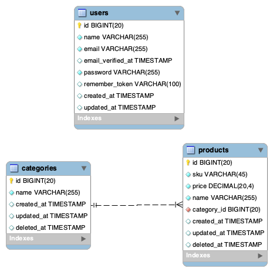

# ERD

# Commands to execute outside Docker
`docker-compose build`

`docker-compose up -d`

`docker exec -it smooth-app bash -c "sudo -u devuser /bin/bash" `

# Commands to execute inside of Docker

`composer install`

`php artisan migrate:install`

`php artisan config:cache --env=local`

`php artisan migrate --env=local`

`php artisan db:seed --env=local`

# Test commands inside of Docker

`php artisan config:cache --env=testing`

`composer test` 
